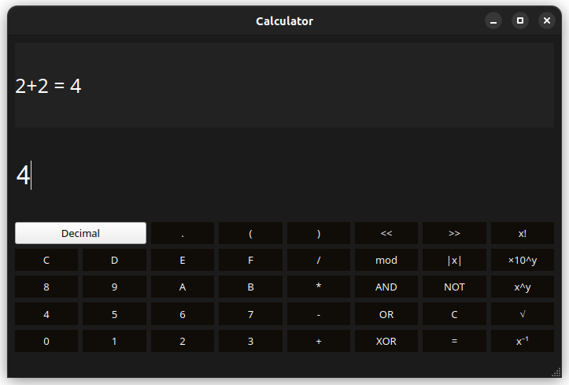

# QtCalculator

A simple GUI calculator built using Qt and C++



## Intro

This program can calculate most of basic mathematical expressions
by evaluating them accordingly to the [Order of operations](https://en.wikipedia.org/wiki/Order_of_operations).
It supports:

- All arithmetic operations (including '=' sign for variable assignment)
- All bitwise operations (~, &, ∨, ^, <<, >>)
- Other helpful operations such as: modulus division, exponentiation,
  absolute value and scientific notation (2E5 = 2 × 10<sup>5</sup>)
- Multiple number bases (binary, octal, decimal and hexadecimal)
- Basic functions such as: sine, cosine, lcm and gcd
- Scrolling through result history by using arrow up and arrow down keys

## Examples

Examples of expressions that this program can calculate:

```
2 + 2 = 4
(0 + 913972 - 1000) * 3 / 2 % 999 = 828
2|1 - 3| + 2|1 - 3| = 8
((13) << 8) >> ((127) % 10 & (31 + 7)) = 52
(5 << 1) ∨ (5 << 2) ^ (5 << 3) = 62
(0 + ~(0xDF234 & 1000) * 3) / -2 = 817.5
1 + (((2 + (3 + (4 + (5 + 6) * -7))) & 127) << 1) * -3 = -359
2*sin(3.1415 / 2) + 3*cos(0) = 5
gcd(24, 36) = 12
0xFF + 0b11 - 015 = 245

x = 3
x**3 + 3*x**2 + 3*x**1 + x**0 = 64
```

## Setup

1. Go into the project directory
2. Create a build folder and go into it

```shell
mkdir build && cd build
```

3. Compile using CMake

```shell
cmake .. && make
```

4. Run it

```shell
./Calculator
```

## License

Licensed under MIT.
